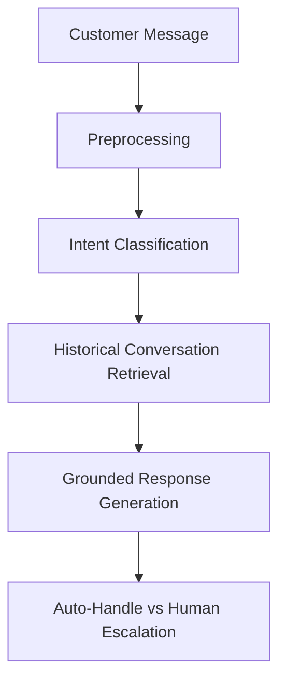

# Spotify Support Agent

An AI customer-support agent for SpotifyCares that classifies incoming support requests, retrieves relevant historical conversations, generates grounded responses, and decides when a human agent should take over.

## Overview

This project builds an automated support agent grounded in the **Customer Support on Twitter** dataset, focusing specifically on interactions handled by the `@SpotifyCares` handle. The core problem being solved is the reliable automation of high-volume customer inquiries (e.g., account issues, bugs, and catalog queries) while maintaining the brand's tone. 

Historical support conversations are highly valuable because they contain verified diagnostic steps, proper policy applications, and realistic conversational styling. Instead of generating unconstrained responses, this agent retrieves past successful interactions as context to safely ground its generative output.

### Main System Flow



## What "Good" Means

Success criteria for this project are divided into five operational pillars. The final system evaluation will use a manually labelled gold set rather than relying only on weak labels to ensure real-world validity.

1. **Intent classification quality**: High precision and recall across core user intents, minimizing misclassification of critical issues (e.g., security problems).
2. **Historical retrieval quality**: Returning conversations that are semantically and practically similar to the current issue.
3. **Response quality**: Generating responses that are accurate, safe, and stylistically aligned with SpotifyCares.
4. **Escalation safety**: Correctly identifying when to stop automated responses and route the conversation to a human agent.
5. **Reproducibility**: Entire pipeline executes reliably from scratch with deterministic behavior.

## Dataset

- **Source**: [Customer Support on Twitter (Kaggle)](https://www.kaggle.com/datasets/thoughtvector/customer-support-on-twitter)
- **Fields Utilized**: `tweet_id`, `author_id`, `inbound`, `created_at`, `text`, `in_response_to_tweet_id`.
- **Selection Strategy**: The dataset is filtered programmatically for `author_id == 'SpotifyCares'`, expanding bidirectionally to capture the surrounding customer context using set-based graph traversal.
- **Conversation Reconstruction**: Threads are rebuilt into multi-turn structures (Customer $\rightarrow$ Support $\rightarrow$ Customer) by recursively tracking `in_response_to_tweet_id`.
- **Corpus Size**: 
  - Raw Tweets: 2,811,774
  - SpotifyCares Tweets: 43,265
  - Reconstructed Conversations: 28,280
  - Total Customer-Support Exchanges: 41,383
- **Date Range**: `2008-05-08` to `2017-12-03`
- **Preprocessing Decisions**: We apply conservative text cleaning (stripping URLs and normalizing whitespace) but preserve casing, punctuation, and emojis, as these carry critical sentiment and intent signals.

## System Architecture

### 1. Data preprocessing
Downloads the raw corpus, executes vectorized text cleaning, and performs graph traversal to construct isolated conversational subtrees in JSONL format.

### 2. Intent classification
Categorizes incoming customer text into actionable support categories using a text classification pipeline. Currently utilizes TF-IDF and SGD optimization.

### 3. Historical retrieval
Given an intent and a customer message, queries a vector index of the 28,280 reconstructed conversations to find historically successful support responses.

### 4. Response generation
Synthesizes a response using a generative model, grounded strictly by the retrieved historical examples to prevent hallucinations.

### 5. Human escalation
A gating mechanism that monitors intent confidence and response viability. Ambiguous fragments or high-risk intents are routed to a human.

### 6. Evaluation
Automated scoring of intent classification metrics (Precision/Recall/F1) and LLM-as-a-judge evaluation of response quality against a human-labelled gold standard.

## Intent Taxonomy

The current taxonomy consists of 9 distinct classes:

- **account_login**: Login problems, hacked/compromised accounts, email changes, authentication failures.
- **billing_subscription**: Premium plans, upgrades, payments, charges, student/family plans, subscription billing.
- **playback_app_issue**: Playback failures, app bugs, crashes, downloads, autoplay, web-player/device technical problems.
- **content_availability**: Missing songs/albums, unavailable content, regional availability, lyrics/content availability.
- **ads_recommendations**: Advertising complaints and recommendation/Discover Weekly feedback.
- **cancellation_refund**: Cancellation, refunds, unwanted renewals or refund-related requests.
- **agent_handoff**: Requests to DM, provide screenshots, device/OS information, email/contact details, or other support-triage interactions.
- **praise_gratitude**: Thanks, compliments, appreciation, positive closing messages.
- **other_unclear**: Ambiguous fragments, insufficient context, unsupported issues, meta-conversations, or anything that cannot reliably fit another class.

*Note: Initial pipeline labels are derived via heuristics (weak labels) and are NOT presented as human ground truth.*

## M3 Results

| Model | Accuracy | Macro F1 | Weighted F1 |
|---|---|---|---|
| Majority Baseline | 30.64% | 0.0521 | 0.1438 |
| TF-IDF + Logistic Regression | 84.75% | 0.8277 | 0.8508 |
| Improved Classifier (SGD) | 87.75% | 0.8786 | 0.8782 |

These M3 labels are weak labels derived from text heuristics. Therefore, this score measures agreement with the labeling heuristic, not human-level intent classification performance. The final evaluation uses a manually labelled gold set.

## Leakage Prevention

Rigorous separation of training and testing data is enforced across the pipeline:
- **Conversation-Level Split**: Data is partitioned strictly by `conversation_id`. No conversation appears in both train and test splits.
- **Message Isolation**: If a customer replies multiple times in the same thread, all their messages belong to the same split. This prevents the model from artificially learning user-specific idiosyncrasies.
- **Feature Separation**: Target labels or weak-label rules are never leaked into the input features.
- **Retrieval Integrity**: Future retrieval evaluation will similarly enforce conversation-level isolation to ensure the system cannot retrieve the exact conversation it is currently trying to answer.

## Evaluation Plan

The complete evaluation strategy relies on transitioning from weak heuristics to verified ground truth:

- **Gold Set Construction (Planned)**: Sample 150–250 diverse examples across intents for manual human labelling.
- **Intent Evaluation (Completed for Weak Labels)**: Automated metrics including Accuracy, Macro/Weighted F1, and Confusion Matrices.
- **Retrieval Evaluation (Planned)**: Metrics measuring the relevance of retrieved historical conversations.
- **Response Quality & LLM Judge (Planned)**: Evaluating the final generated text using LLM-as-a-judge (assessing accuracy, tone, and helpfulness), comparing the judge's scores against human ratings to ensure alignment.
- **Escalation Correctness (Planned)**: Evaluating False Positives/False Negatives in the handoff mechanism.

## Baselines

Establishing strong baselines ensures subsequent architectural complexity is actually justified:

- **Majority Classifier (Implemented)**: Validates that performance exceeds random guessing and provides the floor for class imbalance.
- **TF-IDF + Logistic Regression (Implemented)**: Tests linear separability of text features to ensure complex architectures are necessary.
- **TF-IDF Retrieval (Planned)**: A simple BM25/TF-IDF lookup to benchmark against dense embedding retrieval.
- **Simple Response (Planned)**: Generating an answer without historical context to measure the value-add of Retrieval-Augmented Generation (RAG).

## Reproducibility

Designed to be reproducible in approximately 15 minutes on a normal machine (this is an estimate based on CPU benchmarking, subject to network bandwidth and local hardware speed), subject to dataset download and network speed.

```bash
# 1. Clone and setup
git clone https://github.com/sidverma2407-png/spotify-support-agent.git
cd spotify-support-agent
pip install -r requirements.txt

# 2. Download and extract raw data
python src/data/download.py

# 3. Preprocess and reconstruct graphs
python -m src.data.sample_brand
python -m src.data.eda

# 4. Generate weak labels
python -m src.intent.build_labels

# 5. Run Intent Classifiers
python -m src.intent.baseline_majority
python -m src.intent.baseline_tfidf
python -m src.intent.classifier

# 6. Run all test suites
pytest tests/
```

## Project Structure

```text
spotify-support-agent/
├── app/
├── data/
│   ├── raw/
│   ├── processed/
│   └── gold/
├── evaluation/
├── results/
├── src/
│   ├── data/
│   ├── intent/
│   ├── retrieval/
│   ├── generation/
│   └── escalation/
├── tests/
├── DECISION_LOG.md
├── README.md
└── requirements.txt
```

## Current Status

| Component | Status |
|---|---|
| Dataset + preprocessing | Complete |
| Intent classification | Complete |
| Historical retrieval | Complete |
| Response generation | Planned |
| Escalation | Planned |
| Gold evaluation set | Planned |
| LLM judge | Planned |

## What Wasn't Built Yet

This is an ongoing project. Currently, the generative response modules, human escalation logic, and the manually annotated gold evaluation set have not yet been implemented. 

## Known Limitations

- **Heuristic Taxonomy**: The current labels are weakly generated using text heuristics and regex rules.
- **Ambiguity**: Conversational fragments and ambiguous customer replies are difficult to classify statelessly and currently default to `other_unclear`.
- **Validation**: Human-labelled evaluation is still required to validate true real-world classification performance.

## Decision Log

Key engineering decisions, architecture choices, and rationale are documented in [DECISION_LOG.md](DECISION_LOG.md).

## License / Dataset Attribution

Dataset provided by [thoughtvector on Kaggle](https://www.kaggle.com/datasets/thoughtvector/customer-support-on-twitter). Please refer to Kaggle for dataset terms of use.